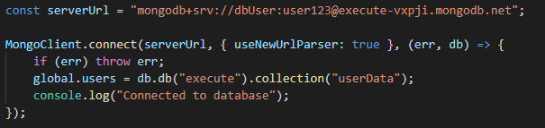
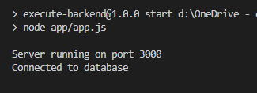
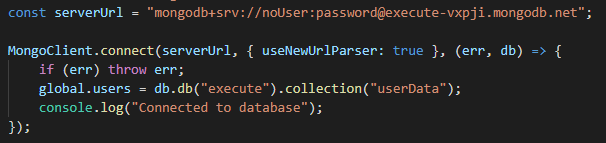
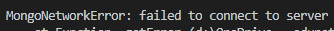
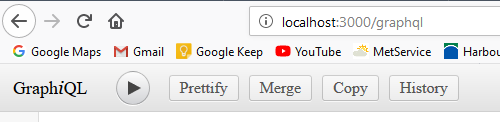
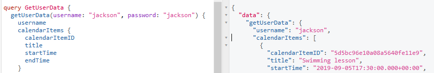
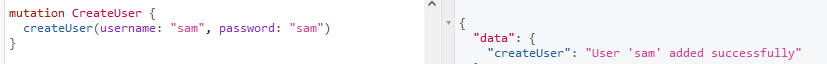

# Testing Documentation

This contains the regression testing for the Execute Backend project

## Manual Tests

### Database

#### Test Plan

1. Logging in with *User* account should have access to read and write to the database
2. Logging in with incorrect user details should not give any access to the database.

#### Test Results - Version 1.3.1

1. Logging in with *User* account hase access to read and write to the database.

2. Logging in with incorrect user details should not give any access to the database.

### API

#### Test Plan

1. The `/graphql` endpoint should give access to GraphiQL and its documentation.
2. The clients application should be able to POST GraphQL queries to the endpoint and get back results.
3. The clients application should be able to POST GraphQL mutations to the endpoint and edit or add new data.

#### Test Results - Version 1.3.1

1. The `/graphql` endpoint has access to GraphiQL and its documentation.

2. The clients application are able to POST all GraphQL queries to the endpoint and get back valid results, all tested from GraphiQL.

3. The clients application are able to POST all GraphQL mutations to the endpoint and edit or add new data with valid results, all tested from GraphiQL.

